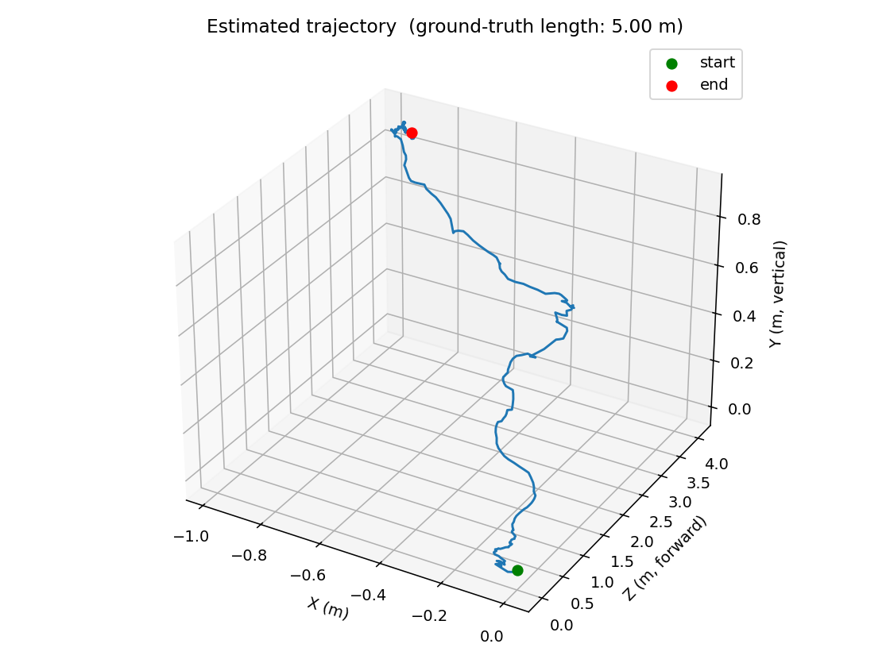

# monocular-vo

[](https://github.com/raahimnawaz/monocular-vo/actions/workflows/ci.yml)
[](LICENSE)
[](https://www.python.org/)

Monocular visual odometry from a single calibrated webcam, with **metric-scale trajectory recovery** via [Depth Anything v2](https://huggingface.co/depth-anything/Depth-Anything-V2-Metric-Indoor-Large-hf) from HuggingFace.

Every monocular VO repo on GitHub hits the same wall: the essential-matrix formulation recovers translation only up to scale. Most repos either ignore this or hard-code a constant. This one resolves it by predicting per-pixel metric depth with a modern foundation model, backprojecting matched keypoints into 3D space in meters, and solving PnP for relative pose. The output trajectory has **real-world units**.

> **Status:** v1 — single-camera recording + pipeline + ground-truth scale evaluation. KITTI benchmark (v2) and pose-graph SLAM with loop closure (v3) are queued.

## Headline result

Recorded a tape-measured **5.00 m straight-line hallway walk** on an Apple M5 MacBook Pro with the built-in webcam. Pipeline: 1280×720 @ 30 fps, processed at stride 2 (371 frames). Depth model: Depth Anything v2 Metric Indoor (Small, ~99 MB).

| Metric | Sanity bound | Measured |
|---|---|---|
| Scale error vs measured 5 m | < 15 % | **12.96 %** |
| End-point distance from start | n/a (drift indicator) | 4.23 m |
| Depth inference (M5 MPS, Small) | 200-800 ms / frame | **227 ms** |
| VO step (per frame) | < 50 ms | **14 ms** |
| Median inliers / frame | > 100 | **1161** |
| Degenerate steps skipped (of 356) | n/a | 14 |
| Calibration reprojection error | < 0.5 px | 0.48 px |



The trajectory shape matches a walking gait — small left-right wobble from holding the laptop while walking forward. The largest remaining error is **apparent vertical drift (~87 cm)** even though the walk was on level ground, caused by per-frame depth-model noise propagating into the rotational component of the PnP solution. That class of error compounds without a back-end and is exactly what v3's pose-graph optimization will address.

## How it works

For each consecutive pair of frames `(t-1, t)`:

1. **Features.** ORB keypoints + descriptors on both frames (2000 features, `cv2.ORB_create`).
2. **Match.** Brute-force Hamming match with Lowe's ratio test (0.75) — discards ambiguous correspondences.
3. **Depth.** Predict per-pixel metric depth on frame `t-1` using Depth Anything v2 (Metric, indoor or outdoor variant). Returns an `(H, W)` array in meters.
4. **Backproject.** For each matched keypoint in `t-1`, look up its depth and unproject through the intrinsics:

   $$X_{t-1} = z \cdot K^{-1} \begin{bmatrix} u \\ v \\ 1 \end{bmatrix}$$

   The result is a 3D point cloud in frame `t-1`'s camera coordinates, in meters.
5. **PnP for relative pose.** `cv2.solvePnPRansac` finds the (R, t) that projects those 3D points onto their matches in frame `t`. **Translation is in meters** because the 3D points were.
6. **Accumulate.** Compose into the world frame: `T_world←t = T_world←t-1 · (T_t←t-1)^-1`.

Why depth-based PnP rather than the standard essential-matrix approach:

- Essential matrix recovers translation only up to scale (a unit vector). Depth-based PnP gives true metric translation.
- PnP also degrades gracefully under near-pure-rotation motion, where essential matrix is ill-conditioned.

The price is that **trajectory error inherits depth-model error**. Depth Anything v2 Metric is good but not exact, particularly at long range and on out-of-distribution scenes. The "scale error" metric above is the honest read.

## Quickstart

```bash
git clone https://github.com/raahimnawaz/monocular-vo
cd monocular-vo
uv sync
```

Before recording, **disable macOS Center Stage** (System Settings → Camera) — it auto-crops and shifts the image mid-recording, which silently breaks the constant-intrinsics assumption every VO pipeline depends on.

```bash
# 1. Print data/chessboard/pattern.pdf (9x6 inner corners, 25mm squares) and mount it on something flat.
# 2. Calibrate (~20 chessboard views; live preview):
uv run python scripts/run_calibration.py --output data/calibration.npz

# 3. Record a sequence walking a tape-measured straight path:
uv run python scripts/run_capture.py --duration 30 --label hallway-5m

# 4. Run VO end-to-end:
uv run python scripts/run_vo.py data/sequences/hallway-5m.mp4 \
    --calibration data/calibration.npz \
    --ground-truth-length 5.0
```

Outputs land in `data/sequences/hallway-5m/`: `trajectory.csv`, `trajectory.png`, `metrics.json`, and a side-by-side `demo.gif`.

## Tests

```bash
uv run pytest
```

CI runs the synthetic VO test (no model download, no camera). The depth-sanity test is gated behind the `downloads_model` marker — opt in locally with `pytest -m downloads_model`.

## Repo layout

```
monocular-vo/
├── src/monocular_vo/
│   ├── calibrate.py      # OpenCV chessboard calibration
│   ├── capture.py        # webcam capture
│   ├── depth.py          # Depth Anything v2 wrapper (HF transformers)
│   ├── vo.py             # ORB + match + depth-backprojection + PnP pipeline
│   └── visualize.py      # 3D trajectory plot + side-by-side animation
├── scripts/
│   ├── run_calibration.py
│   ├── run_capture.py
│   └── run_vo.py
└── tests/
    ├── test_vo_synthetic.py   # 2-frame synthetic motion (CI-safe)
    └── test_depth.py          # depth sanity (downloads HF model; gated)
```

## Roadmap

- **v1 (this release):** monocular VO, metric scale via Depth Anything v2, single-walk scale-error evaluation
- **v2:** evaluate on KITTI sequence 00, report ATE/RPE vs published baselines
- **v3:** add g2o pose-graph back-end + DBoW2 loop closure → mini SLAM
- **v4:** fuse with IMU through the EKF from [vehicle-dynamics-estimation](https://github.com/raahimnawaz/vehicle-dynamics-estimation) → visual-inertial odometry on a Jetson Nano

## Honest caveats

- Drift accumulates frame-to-frame without loop closure. v1 explicitly does not address this — that's what v3 is for.
- Per-frame metric depth is only as accurate as the foundation model. Errors at long range and on materials outside the training distribution (glass, foliage at dusk, etc.) feed directly into scale error.
- Depth-Anything inference dominates per-frame latency. The whole pipeline is not yet real-time on CPU/MPS; that's a v2 problem to tackle alongside KITTI benchmarking.

## License

MIT.
